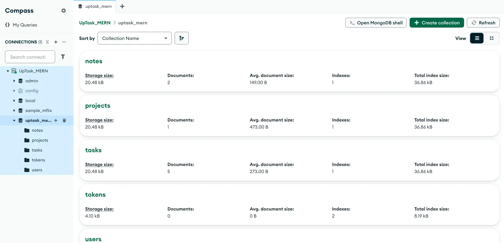
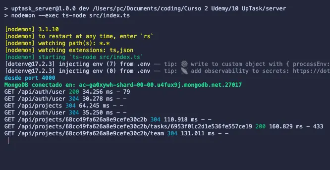

<table width="100%" align="center">
  <tr>
    <td align="center" valign="middle">
      <h1>🗒️ UpTask - Backend API Restful</h1>
      
<b>Arquitectura Escalable para Gestión de Proyectos</b>

      

      
Node.js | Express | TypeScript | MongoDB | Zod

    </td>
  </tr>
</table>

<table>
  <tr>
    <td width="50%">
      

        
      

    </td>
    <td width="50%">
      

        
      

    </td>
  </tr>
</table>

## Visión General

El backend de **UpTask** es una API Restful robusta construida con Node.js. Su arquitectura está diseñada para desacoplar la lógica de negocio de las rutas, permitiendo escalabilidad y testabilidad. Actúa como la única fuente de verdad, manejando la integridad de datos, la autenticación y la compleja lógica de relaciones entre Proyectos, Tareas y Equipos.

---

## Stack Tecnológico y Justificación Técnica

| Tecnología | Implementación y Justificación en UpTask |
| :--- | :--- |
| **Node.js & Express** | Elegido para manejar la arquitectura **REST API**. Implementé un patrón de diseño donde Express solo enruta, delegando la lógica a controladores tipados. Esto permite manejar múltiples peticiones concurrentes (usuarios editando tareas al mismo tiempo) sin bloquear el Event Loop. |
| **TypeScript** | Implementación crítica para la **integridad de datos**. Lo utilicé para tipar estrictamente los `Request` y `Response` de Express. Esto asegura que los objetos que viajan desde la base de datos hasta el JSON de respuesta cumplan siempre con las interfaces `IProject` o `ITask`, eliminando errores de "propiedad inexistente" en producción. |
| **MongoDB (Mongoose)** | Seleccionado por su flexibilidad para manejar relaciones no rígidas. En UpTask, las tareas pertenecen a proyectos pero también tienen notas y colaboradores. El modelo de documentos de Mongo me permitió usar **referencias (`ref`) y `populate`** para traer toda la información de un proyecto y sus tareas asociadas en una sola consulta eficiente. |
| **Zod** | Utilizado para la **validación de esquemas en tiempo de ejecución**. En lugar de ensuciar los controladores con `if (req.body.name === '')`, creé middlewares con Zod que validan los datos entrantes contra un esquema estricto antes de que toquen la lógica de negocio, rechazando "basura" de forma temprana. |
| **JWT** | Implementado para crear una autenticación **Stateless**. Al no guardar sesiones en el servidor, la API puede escalar. Creé un middleware personalizado que decodifica el token, verifica su firma y adjunta el usuario autenticado al `req` para ser usado en las políticas de acceso. |
| **Nodemailer** | Integrado para el flujo de **Confirmación de Cuentas y Reset de Password**. Lo configuré con credenciales dinámicas para enviar tokens de seguridad vía email, garantizando que solo usuarios con correos reales puedan acceder a la plataforma. |

---

## Seguridad y Arquitectura

### 1. Patrón MVC (Model-View-Controller)
Aunque es una API (sin Vistas HTML), seguimos una estructura de **Controladores** y **Servicios**. Las rutas solo definen los endpoints; los controladores manejan la petición y delegan la lógica de negocio a los modelos.

### 2. Middleware de Autenticación Personalizado
Desarrollé un middleware `isAuth` que intercepta cada petición protegida. Verifica la firma del JWT, decodifica el ID del usuario, busca en la DB si el usuario existe y lo inyecta en el objeto `req`. Esto centraliza la seguridad en un solo punto.

### 3. Sanitización y Prevención de Inyecciones
Gracias a Mongoose y Zod, todas las entradas son sanitizadas. Además, se implementa CORS configurado estrictamente para aceptar peticiones solo desde el dominio del frontend confiable.

---

## Estructura de la API

* **`/config`**: Configuración de DB y CORS.
* **`/controllers`**: Lógica de entrada/salida de peticiones.
* **`/middleware`**: Validaciones y chequeos de sesión.
* **`/models`**: Esquemas de Mongoose con tipado TypeScript.
* **`/routes`**: Definición de endpoints.
* **`/emails`**: Lógica de envío de correos (Auth).